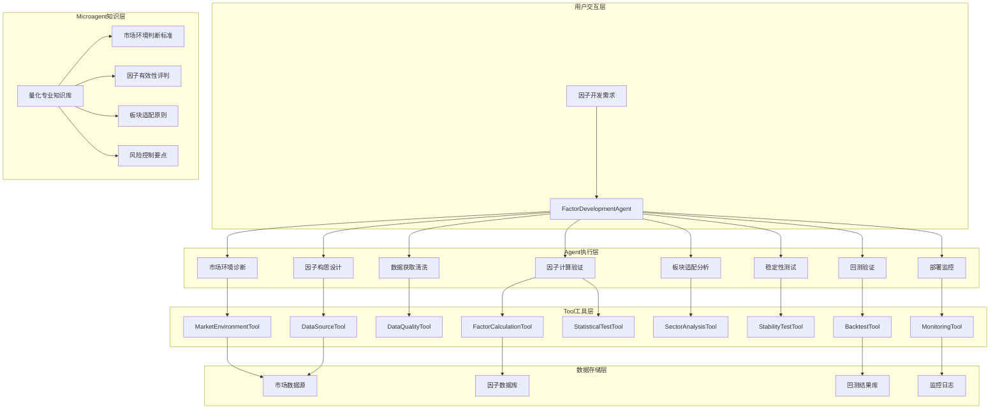

# OpenHands量化因子开发系统架构设计文档

## 📋 文档概述

本文档基于OpenHands框架，设计了一套完整的量化因子开发系统。该系统通过Agent、Tool和Microagent的三层架构，实现了从市场环境诊断到因子部署的全流程自动化开发。

---

## 🏗️ 系统架构设计

### 1. 整体架构图



### 2. 三层架构详解

#### 2.1 Agent层：业务流程控制
- **职责**: 协调整个因子开发流程，包含业务逻辑和决策能力
- **特点**: 可执行具体操作，调用Tools，具有推理能力
- **核心组件**: `FactorDevelopmentAgent`

#### 2.2 Tool层：原子化功能模块
- **职责**: 提供单一功能的数据处理和计算工具
- **特点**: 功能原子化，高复用性，无业务逻辑
- **核心组件**: 9个专业化Tool

#### 2.3 Microagent层：专业知识库
- **职责**: 提供量化领域的专业知识和判断标准
- **特点**: 纯文本知识，通过关键词触发，增强Agent决策
- **核心组件**: 量化专业知识库

---

## 🛠️ 核心组件设计

### 1. FactorDevelopmentAgent

**文件路径**: `openhands/agenthub/factor_agent/factor_development_agent.py`

```python
"""量化因子开发Agent - 核心业务流程控制器"""

class FactorDevelopmentAgent(Agent):
    """专门用于量化因子开发的Agent
    
    功能特点:
    1. 包含完整的因子开发业务流程
    2. 可调用专业化Tools执行具体操作
    3. 具有推理和决策能力
    4. 支持复杂的多步骤工作流
    """
    
    def __init__(self, llm, config):
        super().__init__(llm, config)
        
        # 注册量化专用工具
        self.quant_tools = self._initialize_quant_tools()
        
        # 因子开发状态管理
        self.development_state = {
            "current_stage": "initialized",
            "factor_candidates": [],
            "validation_results": {},
            "optimization_history": [],
            "deployment_status": "pending"
        }
        
        # 工作流配置
        self.workflow_config = {
            "max_iterations_per_stage": 3,
            "ic_threshold": 0.02,
            "significance_level": 0.05,
            "stability_window": 252,
            "backtest_period": "2Y"
        }
    
    async def develop_factor(self, factor_idea: str, target_universe: str) -> Dict[str, Any]:
        """因子开发主流程 - 9个阶段的完整工作流"""
        
        # Stage 1: 市场环境诊断
        # Stage 2: 因子设计
        # Stage 3: 数据准备
        # Stage 4: 因子计算
        # Stage 5: 统计验证
        # Stage 6: 板块分析
        # Stage 7: 稳定性测试
        # Stage 8: 回测验证
        # Stage 9: 生成报告
```

### 2. 专业化Tool集合

#### 2.1 MarketEnvironmentTool
**文件路径**: `openhands/tools/quant/market_tools.py`

```python
class MarketEnvironmentTool:
    """市场环境诊断工具"""
    
    @staticmethod
    def diagnose_market_state(
        indicators: List[str] = ["volatility", "volume", "momentum"],
        period: str = "6M",
        market: str = "A股"
    ) -> Dict[str, Any]:
        """诊断市场环境状态
        
        功能:
        - 波动率分析: 计算当前波动率水平和历史分位数
        - 成交量分析: 评估市场活跃度
        - 动量分析: 判断市场趋势方向
        - 综合状态: 输出市场状态和推荐因子类型
        """
```

#### 2.2 DataQualityTool
```python
class DataQualityTool:
    """数据质量检测工具"""
    
    @staticmethod
    def check_data_quality(
        data: pd.DataFrame,
        missing_threshold: float = 0.1,
        outlier_method: str = "3sigma"
    ) -> Dict[str, Any]:
        """检查数据质量
        
        功能:
        - 缺失值分析: 统计各字段缺失情况
        - 异常值检测: 3σ法则或IQR方法
        - 数据一致性: 检查时间序列连续性
        - 清洗建议: 自动生成数据处理建议
        """
```

#### 2.3 FactorCalculationTool
```python
class FactorCalculationTool:
    """因子计算工具"""
    
    # 支持的因子类型:
    # - 动量因子: 价格动量、成交量加权动量
    # - 反转因子: 短期反转、长期反转
    # - 波动率因子: 收益率波动率、价格波动率
    # - 技术指标: RSI、MACD、布林带、KDJ等
```

#### 2.4 StatisticalTestTool
```python
class StatisticalTestTool:
    """统计检验工具"""
    
    @staticmethod
    def ic_test(factor_values: pd.Series, returns: pd.Series) -> Dict[str, float]:
        """IC检验 - 信息系数检验"""
    
    @staticmethod
    def stability_test(factor_values: pd.DataFrame, window: int = 60) -> Dict[str, Any]:
        """稳定性测试 - 滚动IC分析"""
```

#### 2.5 SectorAnalysisTool
```python
class SectorAnalysisTool:
    """板块分析工具"""
    
    def analyze_factor_by_sector(
        self, 
        factor_data: pd.DataFrame, 
        return_data: pd.DataFrame
    ) -> Dict[str, Any]:
        """按板块分析因子有效性
        
        功能:
        - 行业分组: 按申万行业分类
        - 分行业IC: 计算各行业内因子IC值
        - 适配性评估: 评估因子在不同行业的表现
        - 权重建议: 给出行业权重配置建议
        """
```

### 3. 量化专业知识Microagent

**文件路径**: `openhands/microagents/quantitative_finance.md`

```markdown
---
name: quantitative_finance
type: knowledge
version: 1.0.0
agent: FactorDevelopmentAgent
triggers:
- 因子开发
- 量化因子
- IC检验
- 因子有效性
- 板块轮动
- 市场环境
---

# 量化金融专业知识库

## 市场环境判断标准

### 波动率环境分类
- **低波动环境** (VIX < 15%): 适用动量因子、趋势跟踪因子
- **中等波动环境** (VIX 15-25%): 平衡配置，多因子组合
- **高波动环境** (VIX > 25%): 防御因子、低波动因子、质量因子

### 市场趋势识别
- **牛市特征**: 推荐成长因子、动量因子、小盘因子
- **熊市特征**: 推荐价值因子、质量因子、低波动因子
- **震荡市特征**: 推荐反转因子、波动率因子、事件驱动因子

## 因子有效性评判标准

### IC值评判体系
- **强有效因子** (|IC| > 0.05): 核心因子，权重20-30%
- **中等有效因子** (|IC| 0.02-0.05): 辅助因子，权重10-20%
- **弱有效因子** (|IC| < 0.02): 需要优化或剔除

### 统计显著性要求
- **高度显著** (p-value < 0.01): 优先采用
- **显著** (p-value < 0.05): 谨慎采用
- **边际显著** (p-value < 0.1): 暂不采用

## 板块适配性原则

### 周期性行业适配
- **适用行业**: 钢铁、煤炭、有色金属、化工、建材
- **有效因子**: 价值因子(PB、PE)、盈利因子(ROE、ROA)

### 成长性行业适配
- **适用行业**: 电子、计算机、通信、生物医药、新能源
- **有效因子**: 成长因子、质量因子、创新因子

### 防御性行业适配
- **适用行业**: 食品饮料、公用事业、银行、保险
- **有效因子**: 质量因子、稳定性因子、估值因子

## 风险控制要点

### 因子暴露控制
- 单因子暴露 < 2倍标准差
- 行业中性化处理
- 市值中性化处理

### 换手率控制
- 日换手率 < 20%
- 月换手率 < 100%
- 交易成本评估

### 容量管理
- 流动性评估
- 冲击成本控制
- 规模上限设定
```

---

## 🚀 功能开发步骤

### Phase 1: 基础架构搭建 (Week 1-2)

#### 1.1 环境准备

**任务清单**:
- [ ] 安装Python依赖包 (akshare, pandas, numpy, scipy, talib等)
- [ ] 创建项目目录结构
- [ ] 配置开发环境
- [ ] 设置数据源连接

**目录结构**:
```
openhands/
├── agenthub/factor_agent/          # Agent核心代码
├── tools/quant/                    # 量化工具集
├── microagents/                    # 专业知识库
├── data/
│   ├── market_data/               # 市场数据
│   └── factor_data/               # 因子数据
├── results/
│   ├── backtest/                  # 回测结果
│   └── reports/                   # 分析报告
└── config/                        # 配置文件
```

#### 1.2 核心Agent开发

**开发任务**:
- [ ] 实现 `FactorDevelopmentAgent` 基础框架
- [ ] 集成OpenHands Agent基类
- [ ] 实现状态管理和工作流控制
- [ ] 添加错误处理和日志记录

**关键特性**:
- 9阶段因子开发工作流
- 状态持久化管理
- 异常处理机制
- 进度跟踪功能

#### 1.3 基础Tool开发

**开发任务**:
- [ ] 实现 `MarketEnvironmentTool`
- [ ] 实现 `DataQualityTool`
- [ ] 实现 `FactorCalculationTool`
- [ ] 添加单元测试

### Phase 2: 核心功能实现 (Week 3-4)

#### 2.1 数据获取模块

**功能特性**:
- 支持多数据源 (AkShare、Tushare、Wind)
- 股票池管理 (全市场、沪深300、中证500、创业板)
- 价格数据获取 (日线、复权处理)
- 财务数据获取 (利润表、资产负债表、现金流量表)
- 行业分类数据 (申万行业、中信行业)

**开发任务**:
- [ ] 实现 `DataSourceManager` 类
- [ ] 支持多种股票池配置
- [ ] 实现数据缓存机制
- [ ] 添加数据更新功能

#### 2.2 因子计算引擎

**支持的因子类型**:

1. **动量因子**:
   - 价格动量 (5日、10日、20日、60日)
   - 成交量加权动量
   - 动量强度综合指标

2. **反转因子**:
   - 短期反转 (1日、5日)
   - 长期反转 (10日、20日)
   - 成交量反转

3. **波动率因子**:
   - 收益率波动率
   - 价格波动率
   - 成交量波动率
   - 波动率偏度和峰度

4. **技术指标因子**:
   - RSI (6日、14日)
   - MACD (快线、慢线、柱状图)
   - 布林带 (位置、宽度)
   - KDJ (K值、D值、J值)
   - 威廉指标、CCI、OBV

**开发任务**:
- [ ] 实现因子计算器基类
- [ ] 实现各类因子计算器
- [ ] 实现因子计算引擎
- [ ] 添加因子有效性预检

#### 2.3 统计验证模块

**验证方法**:
- IC检验 (Spearman相关系数)
- 显著性检验 (p-value计算)
- 稳定性测试 (滚动IC分析)
- 多重检验校正 (Bonferroni、FDR)

**开发任务**:
- [ ] 实现IC检验算法
- [ ] 实现稳定性测试
- [ ] 实现显著性检验
- [ ] 添加多重检验校正

### Phase 3: 高级功能开发 (Week 5-6)

#### 3.1 板块分析模块

**分析维度**:
- 申万一级行业分类
- 板块轮动分析
- 行业内因子有效性
- 跨行业因子对比

**开发任务**:
- [ ] 实现行业分类映射
- [ ] 实现分行业IC分析
- [ ] 实现板块轮动检测
- [ ] 实现因子行业适配评估

#### 3.2 稳定性测试模块

**测试方法**:
- 滚动窗口IC分析
- 时间序列稳定性
- 参数敏感性测试
- 样本外验证

**开发任务**:
- [ ] 实现滚动IC计算
- [ ] 实现稳定性指标
- [ ] 实现衰减分析
- [ ] 实现稳健性测试

#### 3.3 回测验证模块

**回测功能**:
- 历史回测引擎
- 绩效指标计算
- 风险指标分析
- 归因分析

**开发任务**:
- [ ] 实现回测引擎
- [ ] 实现绩效计算
- [ ] 实现风险分析
- [ ] 实现归因分析

### Phase 4: 系统集成与优化 (Week 7-8)

#### 4.1 Agent工作流集成

**集成任务**:
- [ ] 整合所有Tool到Agent
- [ ] 实现完整工作流
- [ ] 添加决策逻辑
- [ ] 优化执行效率

#### 4.2 Microagent知识库完善

**完善任务**:
- [ ] 补充专业知识内容
- [ ] 优化触发关键词
- [ ] 添加决策规则
- [ ] 验证知识准确性

#### 4.3 系统测试与优化

**测试任务**:
- [ ] 单元测试覆盖
- [ ] 集成测试验证
- [ ] 性能测试优化
- [ ] 用户体验测试

---

## 📊 预期成果

### 1. 技术成果

- **完整的因子开发系统**: 从构思到部署的全流程自动化
- **专业化工具集**: 9个专业量化工具，可独立使用
- **智能决策能力**: 基于专业知识的自动决策
- **高质量代码**: 完整的测试覆盖和文档

### 2. 业务价值

- **提升开发效率**: 因子开发时间从数周缩短到数小时
- **提高因子质量**: 标准化的验证流程确保因子有效性
- **降低技术门槛**: 自然语言交互，降低量化门槛
- **知识积累**: 可复用的专业知识库

### 3. 扩展性

- **多市场支持**: 可扩展到港股、美股等市场
- **多策略支持**: 可扩展到选股、择时、配置等策略
- **多数据源**: 可接入更多专业数据源
- **云端部署**: 支持云端部署和API服务

---

## 🔧 技术规范

### 1. 代码规范

- **Python版本**: 3.8+
- **代码风格**: PEP 8
- **类型注解**: 使用typing模块
- **文档字符串**: Google风格
- **测试覆盖**: 80%+

### 2. 数据规范

- **数据格式**: pandas DataFrame
- **时间格式**: datetime64[ns]
- **缺失值**: NaN标准处理
- **数据类型**: 明确指定dtype

### 3. 接口规范

- **Tool接口**: 统一的输入输出格式
- **Agent接口**: 继承OpenHands基类
- **配置接口**: YAML配置文件
- **API接口**: RESTful设计

### 4. 性能要求

- **响应时间**: 单次因子计算 < 10秒
- **内存使用**: 峰值内存 < 8GB
- **并发支持**: 支持多用户并发
- **数据处理**: 支持万级股票池

---

## 📝 总结

本文档详细设计了基于OpenHands框架的量化因子开发系统，通过Agent、Tool和Microagent的三层架构，实现了专业、高效、智能的因子开发流程。系统具有以下特点：

1. **专业性**: 基于量化金融专业知识设计
2. **智能化**: 具备自动决策和推理能力
3. **模块化**: 高度模块化的设计便于维护和扩展
4. **标准化**: 标准化的开发流程确保因子质量
5. **可扩展**: 支持多市场、多策略的扩展

该系统将显著提升量化因子开发的效率和质量，为量化投资提供强有力的技术支撑。